# Detectando emoções pelo celular para sugestão de músicas.

# Emotion recognition by smartphone for music suggestions.

## Apresentação

O presente projeto foi originado no contexto das atividades da disciplina de pós-graduação *IA930 - Computação Afetiva*, 
oferecida no segundo semestre de 2022, na Unicamp, sob supervisão da Profa. Dra. Paula Dornhofer Paro Costa, do Departamento de Engenharia de Computação e Automação (DCA) da Faculdade de Engenharia Elétrica e de Computação (FEEC).

|Nome  | RA | Especialização|
|--|--|--|
| Alexsandro Ferreira de Barros Júnior | 233768  | Eng. Eletricista|
| Bruno Guedes da Silva  | 203657  | Eng. Eletricista|
| Davi Pereira Da Silva | 233429  | Eng. Eletricista|

## Descrição do Projeto 

Dado o contexto pós pandêmico, constatou-se o aumento da procura por atendimento de saúde mental (3,4) em função do sofrimento advindo dos traumas nesse período caótico. Sendo assim, busca-se através desse projeto obter uma forma de auxiliar, não clinicamente, no tratamento desses traumas valendo-se das tecnologias cotidianas.

Assim, baseado nas experiências sobre influência da música à resposta emocional do ser humano (1,2), propõe-se a detecção de estado emocional do usuário através de sensores de smartwatch para regulação emocional a partir da sugestão de músicas. 

Como dispositivos móveis vem ganhando espaço no cotidiano de muitas pessoas, uma aplicação que apoie a regulação emocional dos usuários através deles teria a capacidade de sugerir momentos de relaxamento em qualquer circunstância do dia, contribuindo para a saúde mental e física dos mesmos.

O objetivo principal do projeto consiste na implementação de um sistema de dois módulos principais: 

1. Detector de estado emocional a partir de dados de acelerômetro e giroscópio;  
2. Módulo de sugestão de música segundo o estado emocional detectado.

Link Vídeo: https://www.youtube.com/watch?v=Ok2jQL6u2_Q

## Abordagem Adotada

### 1. Escolha do Dataset

Foi realizada uma busca por diferentes datasets que apresentassem dados de sensores acelerômetro e giroscópio. Ao total foram listados 5 datasets (ASCERTAIN (11), K-EmoPhone (10), Smarted (9), ECMSP (12) e Emotion-Recognition-Smartwatch (8)) e optou-se pela utilização do dataset Emotion-Recognition-Smartwatch, devido a facilidade da obtenção dos dados (disponibilizados no Github) e estruturação simples.

O dataset foi construído pela coleta de dados de um smartwatch utilizado por voluntários enquanto andavam em um corredor. Antes da coleta, o voluntário assistia a um vídeo ou escutava uma música selecionada para provocar uma resposta emotiva positiva ou negativa. Um terceiro cenário também foi utilizado, onde o voluntário caminhava enquanto escutava uma música. Dessa forma, os dados são estruturados em um arquivo csv para cada voluntário, contendo a sequência de dados coletados pelos sensores do smartwatch e rotulada com uma valência (positiva, neutra ou negativa). No total são 44 arquivos, sendo cada um referente a um voluntário, distribuídos em três experimentos diferentes: ouvir música antes de caminhar, assistir um vídeo antes de caminhar e ouvir música enquanto caminha.

Analisando os dados coletados, temos 3 eixos para cada um dos sensores, Acelerômetro X, Y e Z; Giroscópio Roll, Pitch e Yaw, que se relacionam com os eixos do acelerômetro. Percebemos que, para o dado selecionado, conseguimos diferenciar mais facilmente as emoções nos dados de acelerômetro para o eixo X e do giroscópio no eixo Yaw (Rotação no eixo Z) e Roll (Rotação no eixo X). Segue abaixo as figuras para cada eixo:

<p align="center">
  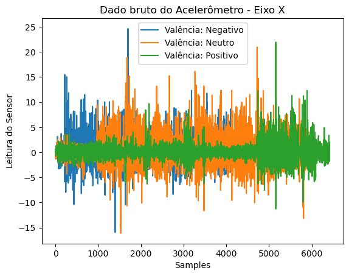
  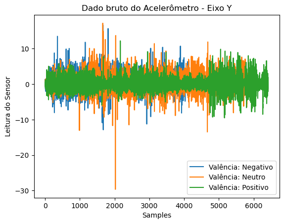
  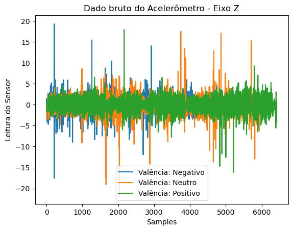
</p>

<p align="center">
  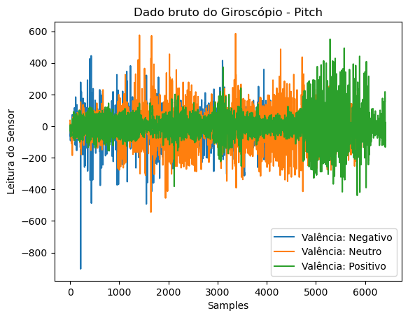
  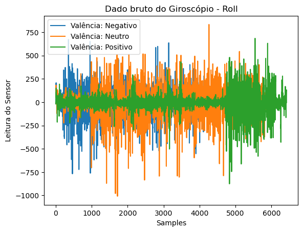
  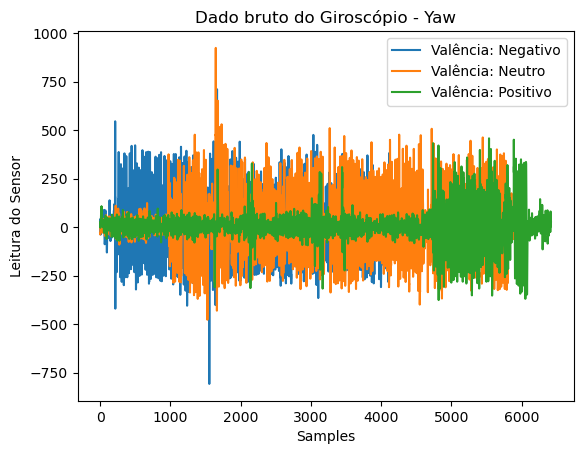
</p>

### 2. Desenvolvimento do módulo de detecção de estados emocionais

A detecção da valência emocional é feita por meio da extração de um vetor de features dos dados dos sensores e a classificação deste vetor por um modelo de aprendizado de máquina.

#### 2.1 Extração de features

Para seleção das features utilizou-se como referência o review de Kołakowska, A. et al. (13), onde é apresentado uma lista das features mais comuns extraídas de séries temporais para uso na classificação de emoções. Para leitura dos dados e extração das features foram utilizadas as bibliotecas numpy e scipy. O código encontra-se no arquivo ```process data.py``` e é utilizado por outros código para pré-processamento dos dados.

#### 2.2 Seleção e treinamento do modelo

Diversos modelos de classificação podem ser utilizados para a tarefa de predição de emoção a partir de um vetor de features, dessa forma utilizou-se a classe GridSearchCV da biblioteca scikit-learn para buscar o melhor modelo e seus hiperparâmetros dentre as opções:
- Regressão Logística
- SVM
- Rede Neural em Camadas
- Adaboost
- Random Forest

O melhor modelo obtido foi um Random Forest com 200 estimadores. O código para a busca em grade pode ser executado por ```python train.py```. Os resultados da busca são salvos em arquivo csv em ```data/grid_search_results.csv```. 

#### 2.3 Avaliação e análise do modelo

A avaliação do modelo foi realizada pela obtenção das métricas de acurácia balanceada e F1 sobre o conjunto de teste, além disso, a matriz de confusão foi construída para avaliação qualitativa do balanceamento entre as classes. A avaliação do modelo pode ser executada por ```python best_model.py```.

Conforme indicado pelo artigo original do dataset, a performance de modelos treinados sobre o conjunto de dados de todos os voluntários não é boa em comparação a modelos específicos para cada pessoa. Para observar esse comportamento, foi treinado um modelo, com mesmos hiperparâmetros descritos anteriormente, em todo o conjunto de dados, mantendo separado para teste somente os dados de um voluntário, sobre o qual é feito o teste para obter as métricas de performance. O experimento pode ser reproduzido pelo comando ```python leave_one_out_model.py```.

Para melhor compreender a queda de performance em modelos gerais comparados a indivíduos, foi feita a redução de dimensionalidade dos vetores de features utilizando o algoritmo T-SNE para observar a existência de estruturas nos dados. O experimento pode ser reproduzido pelo comando ```python data_tsne.py```.

Por fim, optou-se também por analisar a relevância de cada feature utilizada na classificação de emoção. Para isso, utilizou-se o algoritmo de permutação de features do scikit-learn diversas vezes e retirado a média dos resultados. Cada execução do algoritmo de permutação foi realizada com um modelo diferente que foi inicializado aleatoriamente e então treinado no mesmo conjunto de dados. Tal abordagem foi utilizada, pois a Random Forest variava a sensibilidade a permutação de features a cada inicialização, dessa forma a média entre diversas execuções garante valores que melhor representam a importância de cada feature. Para reproduzir o experimento pode-se utilizar o comando ```python feature_importance.py```.

### 3.  Desenvolvimento do módulo de sugestão de músicas

Para desenvolver o módulo que sugere músicas a partir das emoções preditas, pensou-se primeiramente em duas abordagens: o treinamento de um classificador para reconhecer músicas a partir das labels emocionais datadas e assim indicasse uma música para regular a atual emoção predita do usuário; ou utilizar um dataset de músicas já  classificadas por labels emocionais como um banco de dados e aplicar uma lógica simples para a sugestão de uma música para regular a atual emoção predita do usuário.
Assim, considerando a falta de tempo para realizar a primeira implementação, optou-se pela segunda abordagem, uma vez que a sugestão de músicas para regulação de emoção não é uma tarefa trivial, de forma que há diversas nuances sobre qual e que tipo de música deve ser utilizada para o alinhamento emocional considerando cada quadro emocional (1,2).
Isto posto, inicialmente procurou-se diversos datasets de músicas com labels emocionais e optou-se por o apresentado em aula: CAL 500 (6). Esse dataset possui 502 músicas classificadas por 174 labels, onde 17 delas são de cunho emocional. Segundo os autores,

> “Pagamos 66 alunos de graduação para anotar o corpus CAL500 com conceitos do nosso vocabulário. Os participantes foram recompensados com US$ 10 por uma hora bloco de anotação gasto ouvindo música codificada em MP3 através de fones de ouvido em um laboratório de informática da universidade.”(6)

Sendo assim, resolveu-se utilizar esse dataset, uma vez que foi anotado por um número considerável de pessoas e assim conseguiria-se tentar manter a subjetividade presente ao classificar uma música, que é um dos fatores importantes para realizar a regulação emocional.
Logo após a escolha do dataset era necessário separar as anotações emocionais e não emocionais e clusterizá-las em 3 grandes blocos de emoções: positiva, neutra e negativa. Para isso, implementou-se o data_extractor_music_emotion(7)  e conseguiu-se obter um banco de dados de músicas anotadas emocionalmente.
Dispondo do banco de dados aplicou-se a seguinte regra simples para sugestão de músicas:
	
- Se a emoção atual predita para o indivíduo é negativa ou neutra, o sistema irá recomendar aleatoriamente uma música anotada com emoções positivas.
- Se a emoção atual predita para o indivíduo é positiva, o sistema irá recomendar aleatoriamente uma música anotada com emoções neutras.

### 4.  Integração da aplicação

A proposta inicial da integração dos módulos desenvolvidos é mostrada na figura abaixo.

<p align="center">
  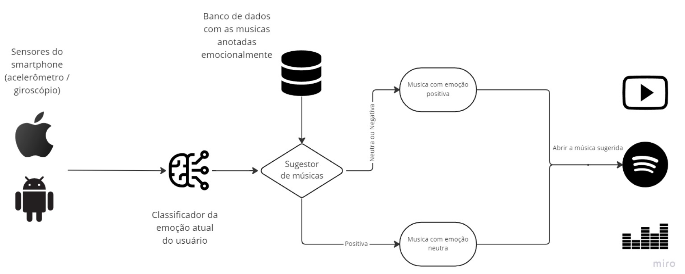
</p>

Assim, o objetivo inicial era que se conseguisse implementar um aplicativo (inicialmente em Android nativo) que integraria as seguintes features: aquisição de dados dos sensores de um acelerômetro e giroscópio do smartwatch; inferência de um classificador de emoções a partir dos dados obtidos; sugestor de músicas classificadas pelas emoções que geram nos indivíduos; reproduzir a música no aplicativo selecionado pelo usuário. 
Entretanto, dado o tempo reduzido, não foi possível realizar a implementação do sistema completo. Assim, a seguinte integração do sistema foi realizada conforme mostrado na imagem.

<p align="center">
  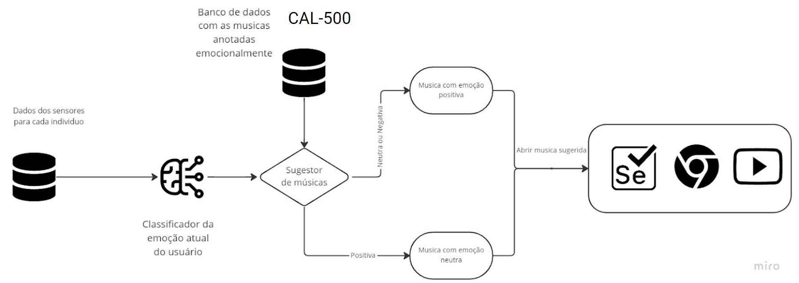
</p>

Isto posto, conseguiu-se integrar um app em python(utilizando uma pequena UI do Tkinter que integraria as seguintes features: escolha de dados de acelerômetro e giroscópio de um indivíduo aleatório ; inferência de um classificador de emoções a partir dos dados obtidos; sugestor simples de músicas a partir das regras simples descritas anteriormente; reproduzir a música sugerida no site do youtube utilizando o Selenium Webdriver pelo Google Chrome(funciona apenas se estiver o google chrome instalado). 

O primeiro passo após decidido o dataset a ser utilizado para treinar o modelo, foi realizar a extração das features dos sinais adquiridos. A função utilizada encontra-se disponível no repositório do github(14). Logo em seguida, iniciou-se o treinamento do modelo para os tipos citados na seção 2.2. 
De posse do modelo treinado, implementou-se o sugestor de músicas conforme descrito anteriormente e também o módulo para reprodução da música sugerida(15).
Por fim, realizou-se a integração dos modulos e realizou-se alguns testes verificando se a emoção era classificada e a música era tocada de acordo com o seguinte caso de teste mostrado na seção 4.1.

#### 4.1 Caso de Teste 1 - Escolha aleatória de dados para classificação emocional do mesmo e sugestão de uma música:

- Executar o arquivo main.py presente na pasta python_app
- Selecionar a pasta que contém os dados dos sensores de acelerômetro e giroscópio dos indivíduos (.\EmotionalMotion\data)
- Verificar a emoção classificada através dos dados mostrada na dialog
- Clicar em OK
- Esperar a música selecionada aleatoriamente de acordo com as regras propostas em 3 abrir no Youtube.

Por falta de tempo não conseguiu-se realizar testes com indivíduos para assim verificar o quão precisa a solução estava. Realizou-se apenas testes dos modelos e o funcionamento do sistema para o “happy path”.

## Resultados Finais

O modelo treinado obteve acurácia balanceada de 66.53% e score F1 de 0,6637. Os resultados, embora promissores, estão abaixo do obtido para modelos treinados individualmente conforme apresentado no artigo base. A matriz de confusão apresentada abaixo, mostra que o modelo ainda possui dificuldades na classificação da emoção neutra.

<p align="center">
  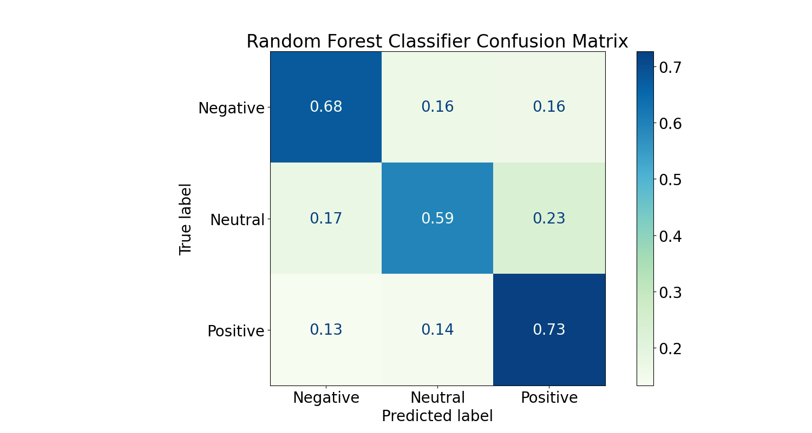
</p>

Para o experimento em que os dados de um voluntário são mantidos fora do conjunto de treino, a performance do modelo aproxima-se de um classificador aleatório, obtendo acurácia balanceada de 24.98% e score F1 0,19. Ademais, a matriz de confusão do modelo apresentada abaixo, mostra que há um grande viés para na classificação dos dados como sendo emoção positiva.

<p align="center">
  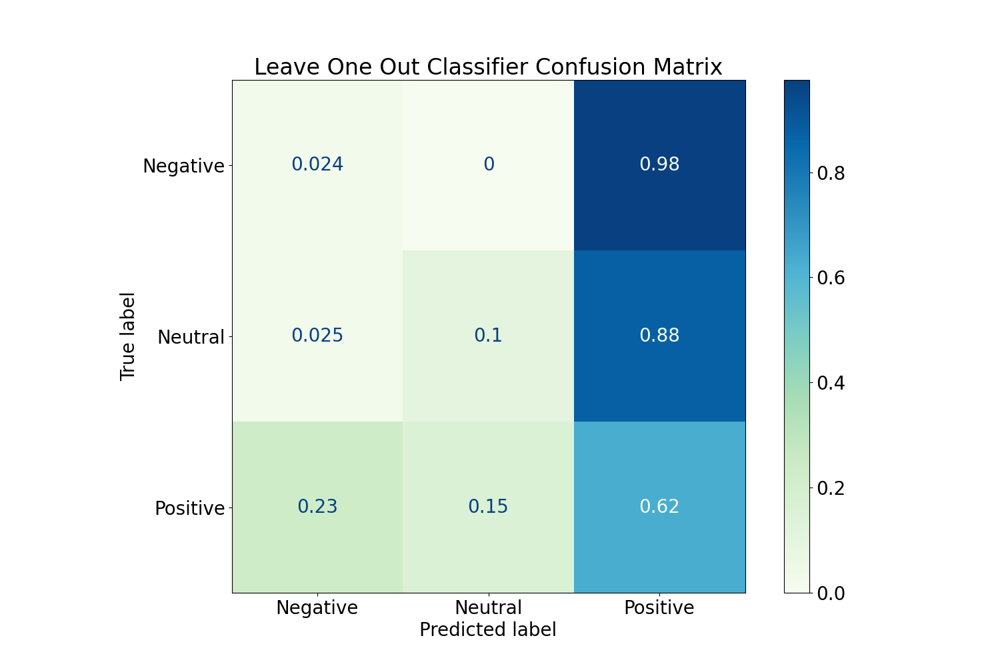
</p>

A imagem abaixo apresenta a análise de redução de dimensionalidades para os vetores de features. Os experimentos 1 a 3 correspondem aos experimentos de ouvir música enquanto caminha, assistir vídeo antes de caminhar e ouvir música antes de caminhar.

<p align="center">
  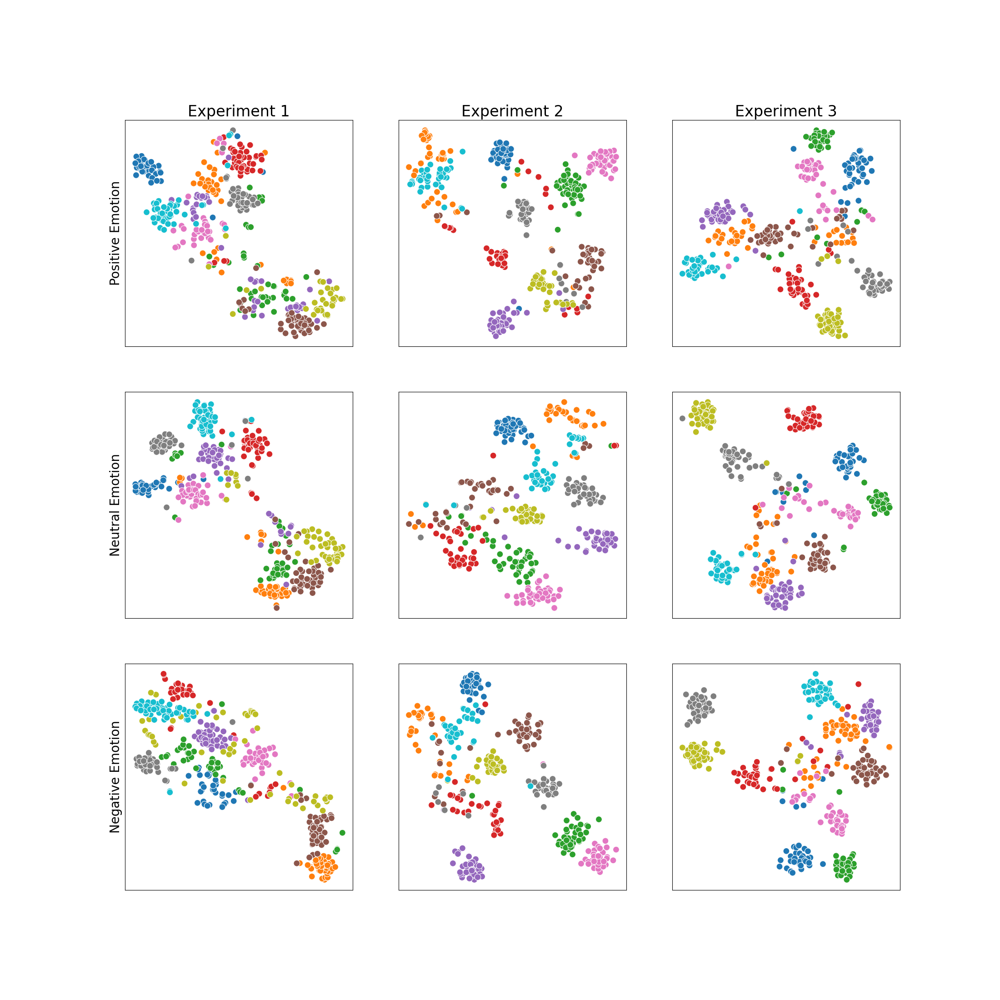
</p>

Abaixo é apresentado parte do gráfico com o ranking das features mais importantes para classificação das emoções. Além disso, o modelo treinado somente com as features de relevância positiva apresentou acurácia balanceada de 67.92% e score F1 de 0,6780.

<p align="center">
  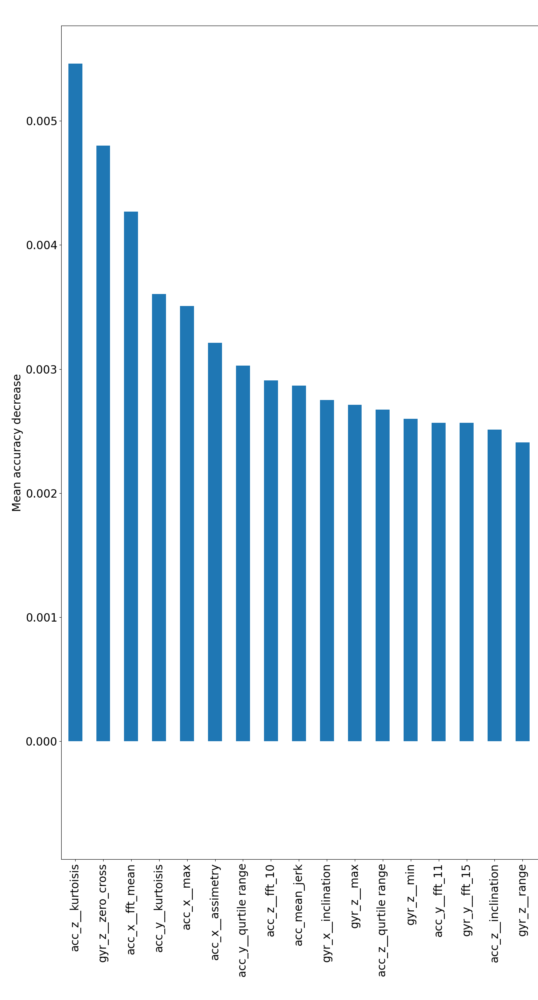
</p>

<p align="center">
  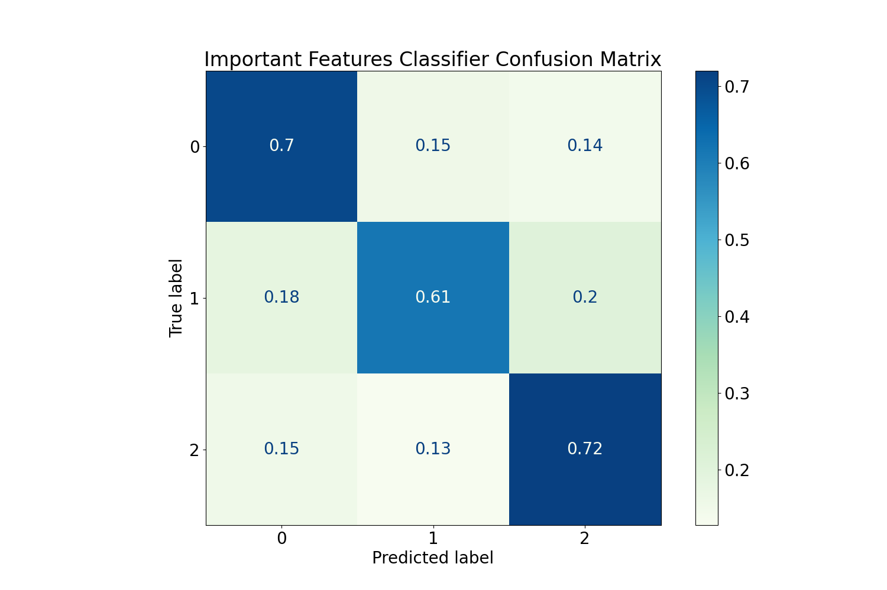
</p>

## Discussão

Os resultados obtidos demonstram uma versão mínima para execução do sistema proposto, demonstrando a capacidade do pipeline de classificação e sugestão de músicas a partir dos dados de sensores de um smartwatch. O sistema não utiliza rotulações de estado emocional complexas, limitando-se a classificação da valência em negativa, neutra e positiva, sendo que informações mais completas são necessárias para uma regulação emocional efetiva e duradoura. Além disso, a implementação foi realizada em desktop e deve ainda ser adaptada para smartphones, onde limitações de recursos computacionais podem surgir e não foram exploradas no trabalho.

O trabalho realizado apresentou diversas dificuldades na utilização dos dados de sensores. As variações nos métodos de captura dos dados utilizados em diferentes experimentos e na escolha de rótulos para emoções (categorias, dimensões, valência, etc.) impedem a comparação clara entre as metodologias aplicadas para classificação de emoções. Como observado pelo gráfico dos dados, os mesmos são por natureza muito ruidosos, além disso a presença de clusters específicos para cada pessoa demonstra que há um desafio extra na generalização da classificação, devido a padrão de resposta para uma certa emoção ser significantemente diferente entre as pessoas.

## Trabalhos Futuros

Como sugestão para trabalhos futuros, trabalhar na melhoria da acurácia do algoritmo seria essencial, devido às limitações de tempo não conseguimos explorar outras features mais elaboradas ou uma análise diferente dos dados utilizados. Além disso, existem diversos outros sensores e dados que podem ser obtidos do smartwatch e ao incorporá-los no algoritmo talvez melhore ainda mais a acurácia do mesmo.
Em seguida, também seria possível uma calibração de músicas para o usuário específico, baseando-se nos dados, se disponíveis, de um aplicativo de músicas como Spotify e Youtube, criar uma seleção ao analisar a emoção do usuário no momento que estava escutando a música selecionada.

## Referências Bibliográficas

(1) ZENTNER, Marcel; GRANDJEAN, Didier; SCHERER, Klaus R. "Emotions evoked by the sound of music: characterization, classification, and measurement”. Emotion 8.4 (2008): 494. Disponível em: https://psycnet.apa.org/record/2008-09984-007

(2) SIMÕES, Ana Rita Chichorro. “As Emoções ao compasso da música: um olhar sobre a influência da música na resposta emocional”. Diss. 2012. Disponível em: https://repositorio.ul.pt/handle/10451/8076

(3) CONCEIÇÃO, Ana e FRISCH, Felipe. “Pandemia aumenta procura por atendimento de saúde mental”. 2021. Disponível em: https://valor.globo.com/brasil/noticia/2021/04/19/pandemia-aumenta-procura-por-atendimento-de-saude-mental.ghtml

(4) MENON, Isabelle. "Pandemia levou a aumento na busca por terapia e lotou agendas". 2022. Disponível em: https://www1.folha.uol.com.br/equilibrioesaude/2022/04/pandemia-levou-a-aumento-na-busca-por-terapia-e-lotou-agendas.shtml

(5) QUIROZ, Juan Carlos; GEANGU, Elena; YONG, Min Hooi; “Emotion Recognition Using Smart Watch Sensor Data: Mixed-Design Study”. JMIR Mental Health, 2018. Disponível em: https://mental.jmir.org/2018/3/e10153/

(6) TURNBULL , Douglas ; BARRINGTON, Luke ; TORRES, David; LANCKRIET, Gerti; “Semantic Annotation and Retrieval of Music and Sound Effects, IEEE Transactions on Audio, Speech and Language Processing, 2008. Disponível em: http://calab1.ucsd.edu/~datasets/cal500/

(7) SILVA, Davi; SILVA, Bruno; BARROS, Alexsandro; “Data Extractor Music Emotion, 2022. Disponível em: https://github.com/brgsil/ia930/blob/main/2022.2/EmotionalMotion/data_extractor_music_emotion/data_extractor.ipynb

(8) Quiroz J, Geangu E, Yong M; “Emotion Recognition Using Smart Watch Sensor Data: Mixed-Design Study” JMIR Ment Health 2018;5(3):e10153 URL: https://mental.jmir.org/2018/3/e10153 DOI: 10.2196/10153

(9) PEPA, L. et al. SMARTED: SMARTwatch Emotion Dataset. Zenodo, , 25 jul. 2022. Disponível em: https://zenodo.org/record/6900984 

(10) KANG, S. et al. K-EmoPhone, A Mobile and Wearable Dataset with In-Situ Emotion, Stress, and Attention Labels. Zenodo, , 3 ago. 2022. Disponível em: https://zenodo.org/record/6851298#.Y44p_XbMJEY 

(11) R. Subramanian, J. Wache, M. K. Abadi, R. L. Vieriu, S. Winkler and N. Sebe, "ASCERTAIN: Emotion and Personality Recognition Using Commercial Sensors," in IEEE Transactions on Affective Computing, vol. 9, no. 2, pp. 147-160, 1 April-June 2018, doi: 10.1109/TAFFC.2016.2625250.

(12) Gao, Zhilin; Cui, Xingran; Wan, Wang; Zheng, Wenming; Gu, Zhongze (2021), “ECSMP: A Dataset on Emotion, Cognition, Sleep, and Multi-model Physiological Signals”, Mendeley Data, V2, doi: 10.17632/vn5nknh3mn.2 
(13) Kołakowska A, Szwoch W, Szwoch M. A Review of Emotion Recognition Methods Based on Data Acquired via Smartphone Sensors. Sensors (Basel). 2020 Nov 8;20(21):6367. doi: 10.3390/s20216367. PMID: 33171646; PMCID: PMC7664622.

(14) SILVA, Davi; SILVA, Bruno; BARROS, Alexsandro; “Process Data, 2022. Disponível em: https://github.com/brgsil/ia930/blob/main/2022.2/EmotionalMotion/process_data.py

(15) SILVA, Davi; SILVA, Bruno; BARROS, Alexsandro; “Python app, 2022. Disponível em: https://github.com/brgsil/ia930/tree/main/2022.2/EmotionalMotion/python_app
